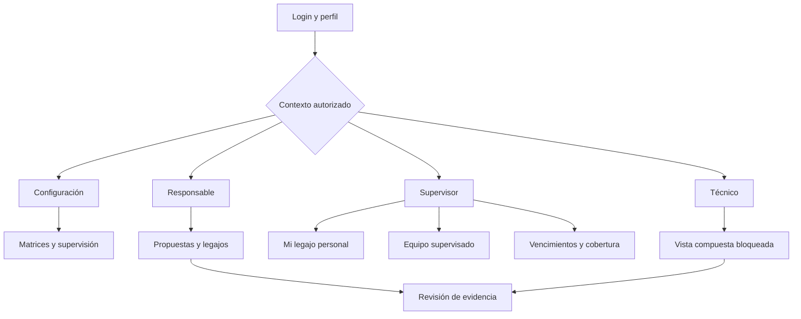
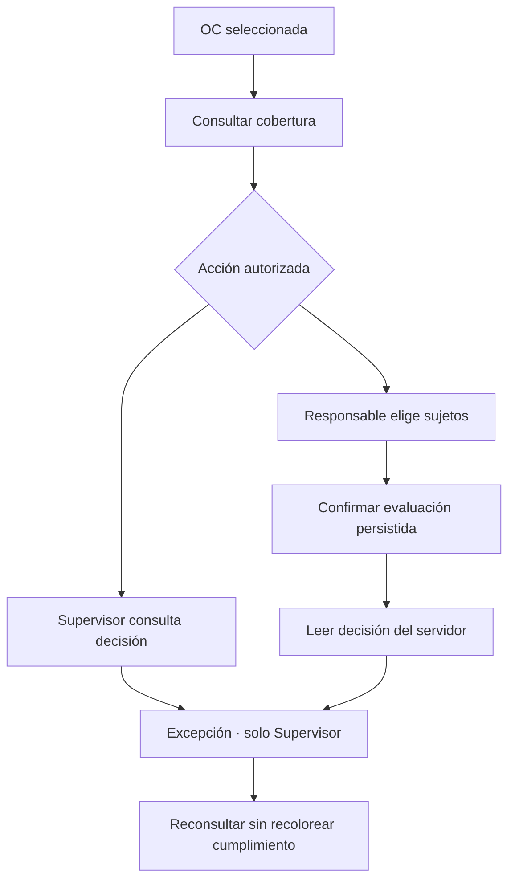

# FieldServiceApp — Navegación por roles

Actualizado 21/09/2026 · Diseño propuesto, pendiente aprobación D-04.

Configuración es un contexto administrativo autorizado; no se agrega un nuevo actor de dominio. C = configuracion, R = responsable_legajos, S = supervisor, T = tecnico. Los paths de esta sección son **rutas del navegador propuestas**, no endpoints del backend.

## Mapa por rol

| Contexto | Entrada tras login | Menú principal | Acciones contextuales | Pendiente explícito |
|---|---|---|---|---|
| C | `/configuracion` · accesos administrativos, sin KPIs fabricados | Matrices/definiciones, Supervisión, Auditoría, Perfil | Alta/baja definición, publicar versión, asignar/reasignar supervisor | Catálogos y selectores; Drive, canales, políticas de alerta, plantillas |
| R | `/propuestas` · bandeja | Propuestas, Legajos, Vencimientos, OC y cobertura, Matrices (consulta), Supervisión, Auditoría, Perfil | Cargar/confirmar/rechazar, acreditación/inducción, evaluar y registrar decisión, particulares, constancias | Buscador de sujetos, lotes documentales, exportación, consultas auxiliares |
| S | `/equipo-supervisado` · universo asignado | **Mi legajo** (contexto personal), **Equipo supervisado** (responsabilidad), Vencimientos, OC y cobertura, Custodias, Perfil | Consultar su estado documental sin presumir habilitación; gestionar únicamente el universo autorizado | G-17/SEL-33 para separar acceso propio y universo; consultas/historiales pendientes |
| T | `/mi-legajo` | Mi legajo compuesto, Perfil | Proponer renovación y adjuntar; descargar evidencia propia | Vista completa persona + vehículo vigente + equipos bajo custodia bloqueada G-05/G-16; notificaciones/QR según contrato futuro |

Durante I1 esas entradas muestran estructura/estado de integración, sin datos simulados. Perfil y logout son accesibles desde encabezado. Menús solo aparecen con la capacidad necesaria; rutas directas usan el mismo guard. Dentro del catálogo de diseño se puede inspeccionar cualquier lámina, claramente fuera de una sesión real. La vista del Técnico mantiene las tres secciones visibles en diseño. Para Supervisor, «Mi legajo» y «Equipo supervisado» son contextos separados; ninguno usa identificadores libres ni presume habilitación por el rol.

## Registro de rutas UI

| Pantalla | Ruta propuesta | Roles UI | Origen contextual / gate |
|---|---|---|---|
| S-01 Login | `/login` | Público | Formulario tenant/email/password |
| S-02 Perfil y sesión | `/perfil` | C/R/S/T | GET /v1/auth/yo |
| S-03 Mi legajo | `/mi-legajo` | T/S | T: vista compuesta bloqueada G-16. S: persona propia potencialmente operativa, bloqueada G-17; el rol no implica habilitación |
| S-03S Equipo supervisado | `/equipo-supervisado` | S | Universo asignado por servidor; selector SEL-33 bloqueado; separado del legajo personal |
| S-03R Legajos | `/legajos/:sujetoId` | R | Selección contextual autorizada; ningún campo libre de ID |
| S-04 Evidencia | `/legajos/:sujetoId/evidencia` | R/T; descarga S en detalle | Modal o subruta del legajo; gate G-01/G-02/G-03 |
| S-05 Propuestas | `/propuestas` | R | Paginación, revisar dentro de la bandeja |
| S-06 Matrices | `/matrices` | C/R; enlace contextual S/T | Selectores cliente/locación/servicio bloqueados hasta consulta; fecha opcional; solo C publica |
| S-07 OC y cobertura | `/oc` y `/oc/:commitmentId` | R/S | No usar oc_id como commitment_id; actualmente corresponde a clave_origen, pendiente schema |
| S-08 Decisiones | `/oc/:commitmentId/decisiones/:referencia?` | R/S | Crear solo R; consultar S con alcance servidor |
| S-09 Vencimientos | `/vencimientos` | R/S | días/offset/limit; no listado de alertas |
| S-10 Auditoría | `/auditoria` | C/R | Filtros tipo/desde/hasta y paginación |
| S-11 Supervisión | `/supervision` | C/R | Selectores de persona/supervisor bloqueados; sin entrada libre de IDs |
| S-12 Custodias/excepciones | `/custodias`; excepción dentro de S-08 | S | Históricos/selectores pendientes; no pantalla operativa en I1 |
| S-13 Lotes | `/lotes` | R | Documental bloqueado H-03; OC bloqueado G-14 y selectores |
| S-14 Configuración | `/configuracion` | C | Accesos locales; integraciones completas pendientes |
| S-15 Capacidades pendientes | Catálogo de diseño, fuera del menú productivo | Revisión de diseño | Sin llamadas API ni promesas de disponibilidad |

No hay rutas de gestión de usuarios, recuperar contraseña o editar perfil porque no existe API correspondiente. No se supone que el frontend pueda ejecutar CLI del servidor.

## Reglas de autorización y multirol

- Unión de capacidades de roles conocidos; sin jerarquía implícita. C no puede cargar documentos, descargar evidencia ni otorgar excepciones solo por ser C.
- Selector «Contexto de trabajo» solo entre roles presentes; cambia organización visual, no identidad ni tenant. Si tiene uno, no mostrar selector. Si tiene varios y no hay preferencia de sesión, ofrecer selección explícita.
- Prioridad de entrada no decide permisos: R/C puede trabajar en Propuestas o Configuración según contexto. Backend valida todas las operaciones.
- R ve todo su tenant; S solo universo autorizado para sujetos y evidencia, y decisiones cuyos sujetos estén todos en él; T solo persona propia en baseline actual. La UX solicitada incluye persona + vehículo vigente + equipos bajo custodia, y su integración completa permanece bloqueada G-05/G-16. No inferir acceso a recursos.
- El backend devuelve OCs del tenant al supervisor y restringe detalle/candidatos/decisiones según alcance. No prometer que el listado de OC sea exclusivamente de «sus» órdenes si el contrato no lo garantiza.
- `ultima_decision=null` no implica «nunca evaluada»: puede ser ocultación de alcance. Mostrar «Sin decisión disponible para esta vista». Una 404 de decisión no confirma existencia.
- Un rol sin acceso no recibe un botón deshabilitado que revele datos ajenos. Una capacidad futura sí puede aparecer como explicación en el catálogo de diseño, sin callback.

## Recorridos principales

La selección de sujetos y el detalle del resultado esperan schemas/selectores. No hay flecha a «Asignar OT»: pertenece a la integración pendiente. Custodia es flujo separado de sujetos propuestos para evaluación; el vehículo no se deduce automáticamente del custodio.

## Recuperación y accesibilidad

Preservar filtros en query de navegación, sin tokens/URLs firmadas. Al login, volver solo a un destino interno permitido. Al perder acceso, cancelar requests y limpiar datos, mostrar explicación y destino disponible. Ante ausencia de sujeto_id del técnico, mostrar «Tu usuario no tiene un legajo asociado»; no permitir introducir otro ID.

Drawer móvil con foco atrapado y retorno al disparador; Escape cierra; skip link al contenido; encabezados y breadcrumb; avisos de error anunciados; tablas con caption y headers. Una acción irreversible de dominio requiere resumen y confirmación; la navegación nunca dispara comandos.
